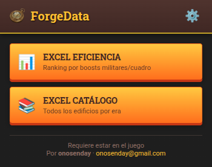

# ForgeData - Forge of Empires Data &amp; Efficiency Analyzer

[🇪🇸 Español](#español) | [🇬🇧 English](#english)

---

## English

A Chrome extension that helps you analyze the efficiency of buildings in your Forge of Empires city and explore the complete game catalog.

The goal is to help you make strategic decisions based on real efficiency data for military boosts and space usage.

### ✨ New in v1.2.2
- **Multilanguage Support**: The extension now supports 5 languages (English, Spanish, French, German, Italian)
- **Auto-detection**: Automatically detects your browser's language
- **Language Selector**: Choose your preferred language in Settings
- **Version Display**: See the current version in Settings

### ⚠️ Transparency &amp; Privacy

This tool has been designed respecting fair play rules:

*   **NOT a bot:** Does not perform any automatic actions in the game. Your account will never take actions without your direct interaction.
*   **NO personal data collection:** All game data is processed **locally**.
*   **Anonymous Usage Statistics:** The extension counts how many times export buttons are used (e.g., "Export Efficiency") to know which features are useful.
    *   This feature is **completely anonymous** (uses a random ID, not your username).
    *   You can **disable it** at any time from Settings.
*   **Does NOT alter the game:** Works only by reading data that the game sends to your browser.

### Features

#### 1. 📊 City Efficiency Analysis (Excel)
Generates a detailed Excel report of **your current city**, calculating the real efficiency of each building.

*   **Efficiency Formula:** Calculates the military boost offered per occupied tile, considering building size and road requirements.
*   **Separate sheets:** Organizes data for different game modes:
    *   **Full Bonus:** Global efficiency.
    *   **BG Bonus:** Specific for Battlegrounds.
    *   **GE Bonus:** Specific for Guild Expedition.
    *   **QI Bonus:** Specific for Quantum Incursions.

#### 2. 📚 Complete Game Catalog (Excel)
Download a database with **all buildings that exist in the game**, organized by Era.

*   Ideal for planning future cities or comparing buildings you don't have yet.
*   Includes attack/defense stats for different modes.

### Installation

1. Download the code or ZIP file from the latest release.
2. Open `chrome://extensions/` in your browser.
3. Enable **Developer mode** (top right).
4. Click **Load unpacked** and select the extension folder.

### Usage

1. Enter your city in Forge of Empires.
2. Click the extension icon (golden compass) in the browser bar.
3. Select the desired option:
    *   **Efficiency Excel:** To analyze what you currently have built.
    *   **Catalog Excel:** To see the list of all game buildings.

The extension will process the data and automatically download the corresponding `.xlsx` file.

### Settings

In the extension settings menu you can configure:
*   **Download location:** Save to default folder, a specific subfolder ("FoE_Data"), or always ask where to save each file.
*   **Language:** Choose from English, Spanish, French, German, or Italian.
*   **Anonymous statistics:** Enable or disable usage tracking.

---

## Español

Una extensión para Google Chrome que te permite analizar la eficiencia de los edificios de tu ciudad en Forge of Empires y explorar el catálogo completo del juego.

El objetivo es ayudarte a tomar decisiones estratégicas basadas en datos reales de eficiencia militar y de espacio.

### ✨ Nuevo en v1.2.2
- **Soporte Multilenguaje**: La extensión ahora soporta 5 idiomas (Inglés, Español, Francés, Alemán, Italiano)
- **Auto-detección**: Detecta automáticamente el idioma de tu navegador
- **Selector de Idioma**: Elige tu idioma preferido en Configuración
- **Versión visible**: Consulta la versión actual en Configuración

### ⚠️ Transparencia y Privacidad

Esta herramienta ha sido diseñada respetando las normas de juego limpio:

*   **NO es un bot:** No realiza ninguna acción automática en el juego. Tu cuenta nunca realizará acciones sin tu interacción directa.
*   **NO recoge datos personales:** Todos los datos del juego se procesan **localmente**. 
*   **Estadísticas de Uso Anónimas:** La extensión cuenta las veces que se usan los botones de exportación (ej: "Exportar Eficiencia") para saber qué funciones son útiles.
    *   Esta función es **totalmente anónima** (usa un ID aleatorio, no tu usuario).
    *   Puedes **desactivarla** en cualquier momento desde la Configuración.
*   **NO altera el juego:** Funciona únicamente leyendo los datos que el juego envía a tu navegador.

### Funcionalidades

#### 1. 📊 Análisis de Eficiencia de Ciudad (Excel)
Genera un informe detallado en Excel de **tu ciudad actual**, calculando la eficiencia real de cada edificio.

*   **Fórmula de Eficiencia:** Calcula el boost militar ofrecido por cada casilla ocupada, teniendo en cuenta el tamaño del edificio y si requiere carretera.
*   **Hojas separadas:** Organiza los datos para diferentes modos de juego:
    *   **Bono Completo:** Eficiencia global.
    *   **Bono CdB:** Específico para Campos de Batalla.
    *   **Bono Expe:** Específico para Expedición de Gremio.
    *   **Bono IC:** Específico para Incursiones Cuánticas.

#### 2. 📚 Catálogo Completo del Juego (Excel)
Descarga una base de datos con **todos los edificios que existen en el juego**, organizados por Era.

*   Ideal para planificar futuras ciudades o comparar edificios que aún no tienes.
*   Incluye estadísticas de ataque/defensa para diferentes modos.

### Instalación

1. Descarga el código o el archivo ZIP de la última versión.
2. Abre `chrome://extensions/` en tu navegador.
3. Activa el **Modo para desarrolladores** (arriba a la derecha).
4. Haz clic en **Cargar descomprimida** y selecciona la carpeta de la extensión.

### Uso

1. Entra en tu ciudad en Forge of Empires.
2. Haz clic en el icono de la extensión (brújula dorada) en la barra del navegador.
3. Selecciona la opción deseada:
    *   **Excel Eficiencia:** Para analizar lo que tienes construido ahora mismo.
    *   **Excel Catálogo:** Para ver la lista de todos los edificios del juego.

La extensión procesará los datos y descargará automáticamente el archivo `.xlsx` correspondiente.

### Configuración 

En el menú de ajustes de la extensión puedes configurar:
*   **Ubicación de descarga:** Guardar en la carpeta por defecto, en una subcarpeta específica ("FoE_Data") o preguntar siempre dónde guardar cada archivo.
*   **Idioma:** Elige entre Inglés, Español, Francés, Alemán o Italiano.
*   **Estadísticas anónimas:** Activa o desactiva el seguimiento de uso.

---

**Note / Nota:** This extension is not affiliated with or endorsed by InnoGames. It is a tool created by fans for fans. / Esta extensión no está afiliada ni respaldada por InnoGames. Es una herramienta creada por fans para fans.